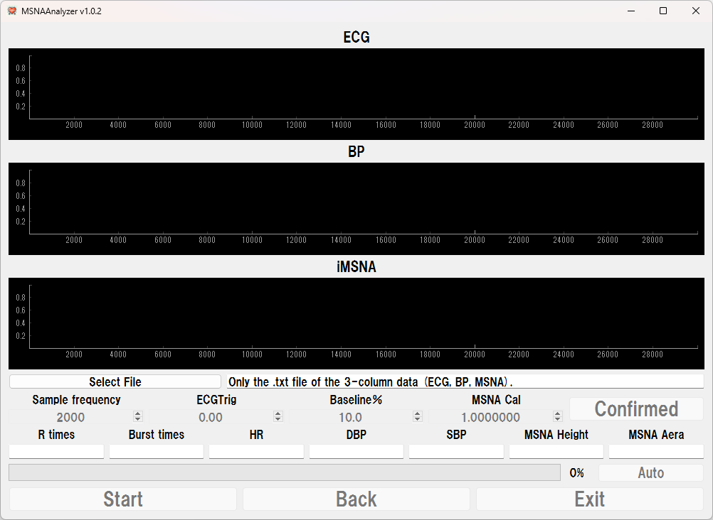
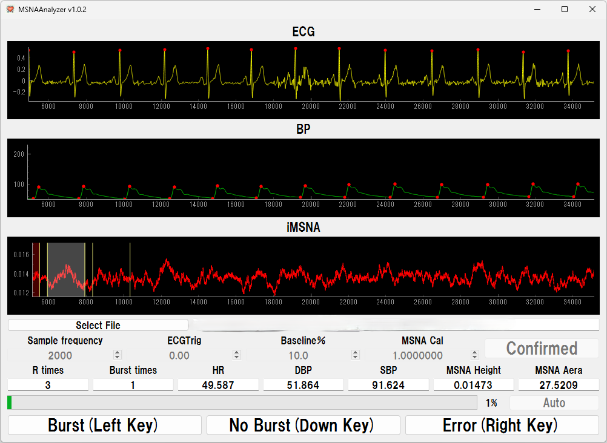

# MSNA-Analyzer

**他の言語で読む：[English](README.md)、[中文](README_zh.md)、[日本語](README_jp.md)。**

## 概要
MSNA-Analyzerは、筋交感神経活動（MSNA）、心電図（ECG）、および血圧信号の分析と可視化を目的としたツールです。PyQt5ベースのインターフェースを使用しており、ユーザーは生理学的データをインポート、分析、可視化することができ、心血管および神経信号の研究をサポートします。MSNAバーストは自動的に、または手動で検出することができ、ユーザーに柔軟な分析オプションを提供します。最近のアップデートでは、マウスの代わりに矢印キーを使用してバーストの識別を高速化するオプションが追加され、分析プロセスの効率が向上しました。

## サンプル図

  
  

## 主な機能
- **自動バースト検出**：MSNAバーストを自動的に検出し、手動での介入を減らします。
- **手動識別**：ユーザーが手動でバーストを識別でき、正確な分析が可能です。
- **矢印キーによる操作**：矢印キーを使用してバースト識別を加速し、分析の効率を向上させます。
- **出力フォーマット**：結果を`txt`または`Excel`フォーマットでエクスポートし、データのアクセスやさらなる処理を容易にします。
- **ユーザーフレンドリーなインターフェース**：直感的で使いやすいインターフェースを提供し、手動モードと自動モードの両方を利用できます。

## インストール

### 必要条件
- Windowsオペレーティングシステム
- .NET Framework 4.7.2以上

### インストール方法
1. [Releases](https://github.com/CC5103/MSNA-Analyzer/releases)セクションから最新バージョンをダウンロードします。
2. zipアーカイブから`MSNAAnalyzer.exe`ファイルを抽出します。
3. 実行可能ファイルを起動してツールを開きます。

## 使用方法

### 自動モード
1. **入力**：`.txt`形式のデータファイルを提供します。
2. **操作**：ツールが自動的にMSNAバーストを検出して分析します。
3. **出力**：結果ファイルが`txt`および`Excel`形式で生成されます。

### 手動モード
1. **入力**：`.txt`形式のデータファイルを提供します。
2. **操作**：矢印キーを使用してMSNAバーストを手動で識別するか、インターフェースを使用して正確に制御します。
3. **出力**：結果ファイルが`txt`および`Excel`形式で生成されます。

## 今後の計画
- バースト検出のためのアルゴリズムをさらに追加する予定です。
- ユーザーインターフェースを改善し、使いやすさを向上させます。
- 追加のデータフォーマットをサポートし、インポートおよびエクスポート機能を拡充します。

## ライセンス
本プロジェクトはGPL-3.0ライセンスの下でライセンスされています。詳細については、[LICENSE](LICENSE)ファイルを参照してください。

## 謝辞
貴重なフィードバックをいただいたすべての貢献者およびテスターの方々に感謝します。