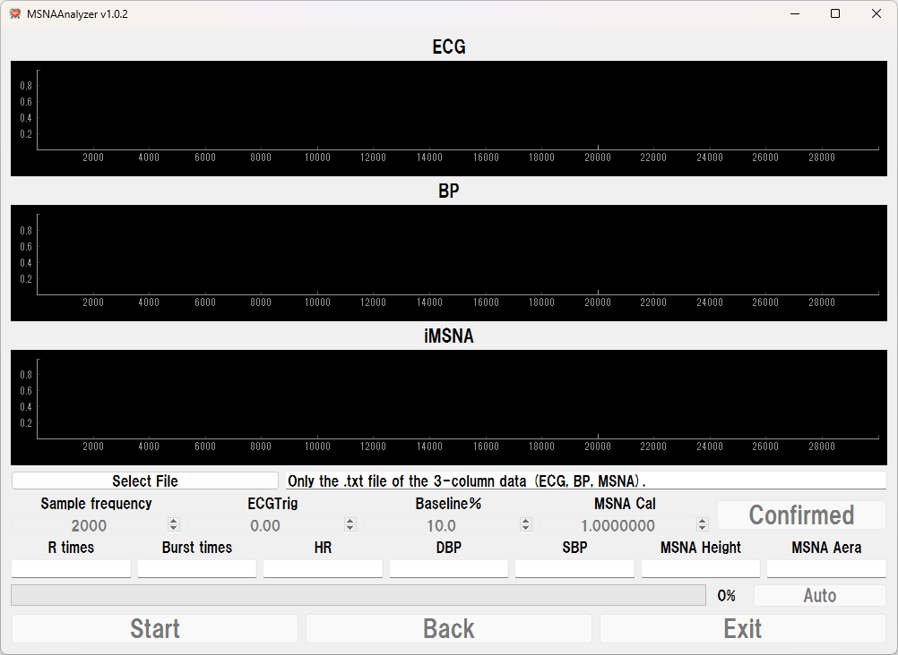
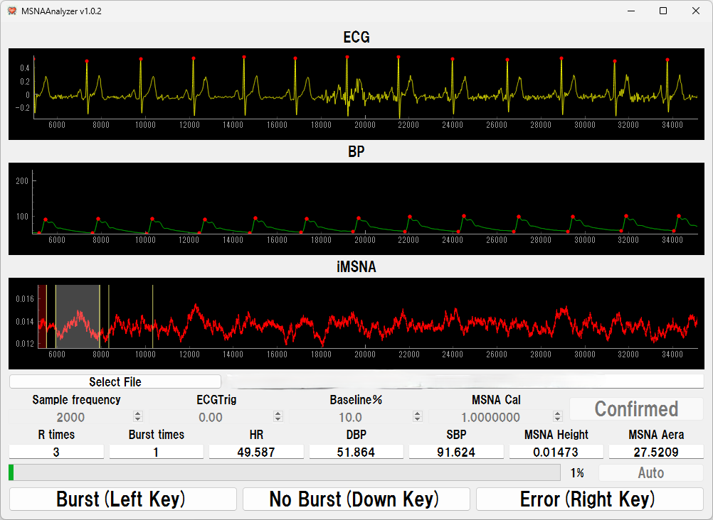

# MSNA-Analyzer

**阅读其他语言版本：[English](README.md)，[中文](README_zh.md)，[日本語](README_jp.md)。**

## 概述
MSNA-Analyzer 是一款用于分析和可视化肌肉交感神经活动（MSNA）、心电图（ECG）和血压信号的工具。通过其基于 PyQt5 的界面，该软件允许用户导入、分析和可视化生理数据，支持心血管和神经信号研究。MSNA 峰值可以通过自动和手动两种方式进行检测，为用户提供灵活的分析选项。近期更新增加了使用箭头键代替鼠标加速峰值识别的功能，从而提高了分析效率。

## 简单示意图

  
  

## 主要特点
- **自动峰值检测**：自动检测 MSNA 峰值，减少手动干预。
- **手动识别**：允许用户手动识别峰值，为精确分析提供灵活性。
- **箭头键控制**：使用箭头键加速峰值识别，提升分析过程的效率。
- **输出格式**：支持将结果导出为 `txt` 或 `Excel` 格式，便于数据访问和后续处理。
- **用户友好界面**：设计简洁直观，提供自动和手动两种模式，方便操作。

## 安装

### 系统要求
- Windows 操作系统
- .NET Framework 4.7.2 或更高版本

### 安装步骤
1. 从 [Releases](https://github.com/CC5103/MSNA-Analyzer/releases) 页面下载最新版本。
2. 从压缩包中提取 `MSNAAnalyzer.exe` 文件。
3. 运行可执行文件启动工具。

## 使用方法

### 自动模式
1. **输入**：提供 `.txt` 格式的数据文件。
2. **操作**：工具将自动检测并分析 MSNA 峰值。
3. **输出**：生成结果文件，支持 `txt` 和 `Excel` 格式。

### 手动模式
1. **输入**：提供 `.txt` 格式的数据文件。
2. **操作**：使用箭头键手动识别 MSNA 峰值，或者通过界面进行精确控制。
3. **输出**：生成结果文件，支持 `txt` 和 `Excel` 格式。

## 更新日志

### v1.0.2
- 按下 "Start" 按钮后禁用了 "Auto" 按钮。

### v1.0.1
- UI 修复：通过修改窗口标题提升界面清晰度。
- 增强：改进了 Excel 文件保存时的默认文件名生成。

### v1.0.0（初始版本）
- 引入了自动峰值检测功能。
- 实现了手动峰值识别功能。
- 支持将结果导出为 `txt` 和 `Excel` 格式。

## 未来计划
- 添加更多的峰值检测算法。
- 改进用户界面，提高可用性。
- 支持更多数据格式的导入和导出。

## 许可证
本项目采用 MIT 许可证。有关更多详情，请参见 [LICENSE](LICENSE) 文件。

## 鸣谢
感谢所有贡献者和测试人员的宝贵反馈。